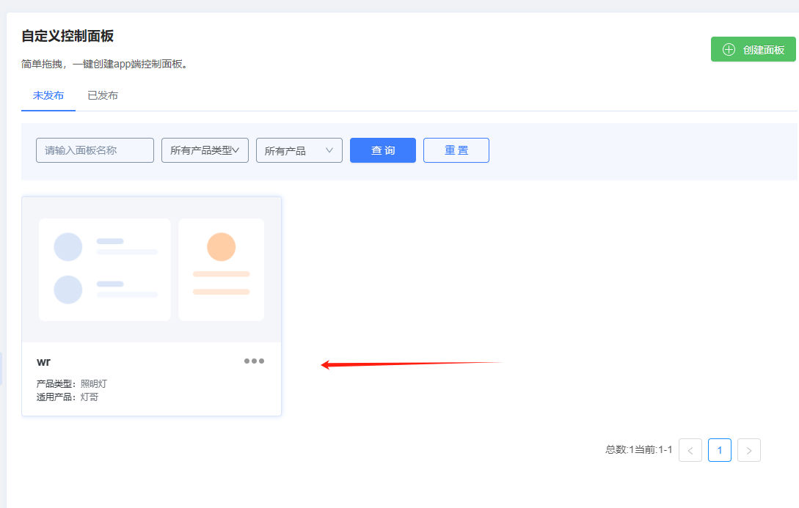
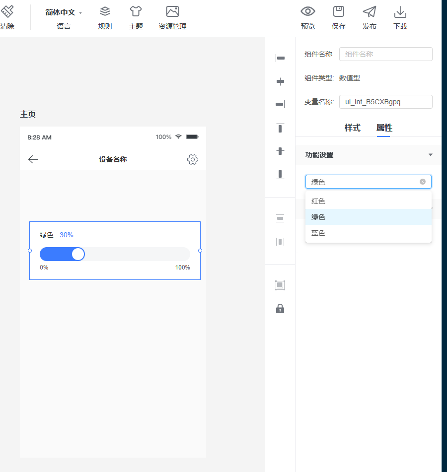

# 以下我接入爱信云的过程

## 第一步：肯定是先去爱信云注册账号登录了，这我就不说了
## 第二部：创建产品

基本上就是安装提示去做就操作就可以了
### 功能定义
在功能上，我添加了些自定义功能

功能含义和数据如图，基本能看出来是什么样的
经过测试，爱信云下发的数据有pdid 和修改的数据 也就是比如json {"101":99}，标识符啥的好像没看见
### 硬件开发

硬件开发这个可以不用理会，应该是用于OTA或AT模组的固件吧，不懂，还是让官方解答吧
### 设备面板
这是在操作的app里点进去控制的界面，因为我是添加了自定义的功能，所以就得使用自定义面板

点击更换面板或者左侧面板管理进入

按照你想要的样子进行添加，所见即所得，哈哈哈

右侧属性进行修改绑定功能或者样式关联
功能就是产品那里添加的定义功能，名称可以中文，这样这里更好查看选择，毕竟我只是个菜鸟，英文太高大上了，

之后就得保存并发布

只有保存并发布了，才能在产品更换面板里可以选择上
每次进行面板修改发布，或者功能添加后。都得进行重新选择面板

### 生产管理
进行三元组生成。这里没必要理解三元组是什么意思，其实就是一组配置

其实要做的就是导入一批序列号（设备sn号），导入格式可以点击下载表格查看然后添加修改，再导入进行了，然后点击确实后，就会生成一批三元组也就是数据配置，

这是数据是要放到固件里的
分别需要的配置为
产品里的产品key和无线标识LIGH，

还有三元组里的
设备名称/设备ID
设备用户名
设备密码
这三个。共五个数据
爱信云上的硬件产品开发就这样
## APP开发
选择OEM APP开发，自定义APP开发因为没有看见有提供SDK接入等方式，暂时用不上

按照提示一路提示操作就可以了

然后等构建完成就可以下载经常测试了，
不知道是不是测试包的原因，我用小米note 安卓9 安装后打开使用的过程中感觉到明显的变卡，一开始不卡，运行一会之后就卡，如果是因为我这台安卓机太卡了的话，我没话说

# 到了做编译固件的部分
我也是基于安信可的一个有关于M61原厂SDK接入爱信云的SDK进行改下，因为菜可能改的很难看。。。。，让我从0开始写根本不可能，太菜了
https://github.com/Ai-Thinker-Open/AiPi-Open-Kits/tree/AiPi-aiThinkerCloud

这个分支库里也有例程

可以自行进行参考

下面是我对爱心云进行对爱信云创建的产品进行接入的工程
https://github.com/LTLyaoni/aiTinkerCloud

各位可以进行指导或者优化

接入流程大概为

之前拿到的数据要填到aiio_dev_config里

详细的代码可以看仓库，看